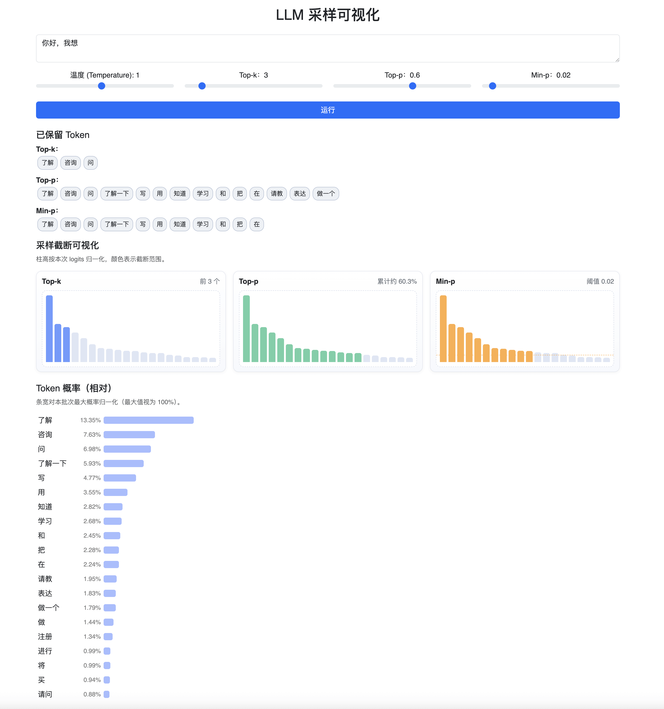

# LLM Sampling

## Quick Start

1) 准备环境  
   - 建议 Python 3.9+，可选：`python -m venv .venv && source .venv/bin/activate`
   - 安装依赖：`pip install -r requirements.txt`

2) 运行服务  
   - 启动：`python app.py`
   - 首次会从 Hugging Face 拉取 `Qwen/Qwen3-0.6B`（需网络）

3) 打开页面  
   - 浏览器访问 `http://localhost:5000`
   - 输入提示词，调节 Temperature / Top-k / Top-p / Min-p，点击“运行”查看概率分布与截断范围

## 界面预览

